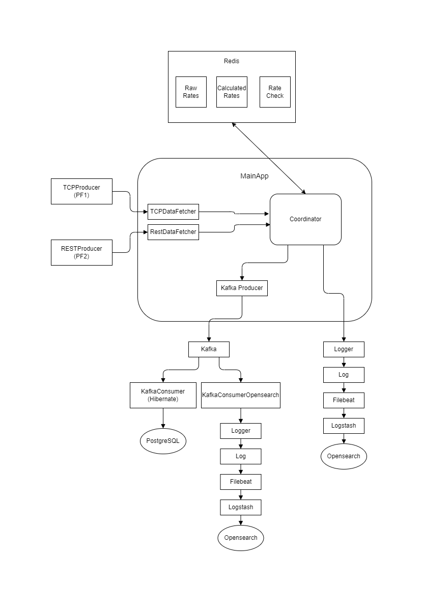

# FintechProject2025
## Project Overview
FintechProject2025 connects to multiple specialized real-time rate data providers (PF1, PF2), aggregates and normalizes incoming rates, computes derived currency pairs (USD/TRY, EUR/TRY), and distributes the data via Kafka. Raw and calculated rates are stored in PostgreSQL and OpenSearch, with Redis caching for fast access.

## Key Features
- Realistic simulation of USDTRY and EURUSD rates from two providers via TCP (PF1) and REST (PF2)
- Calculation of derived rates using platform average for USD/TRY and cross-rate method for EUR/TRY
- Dynamic runtime loading of data-fetching components
- Data distribution via Apache Kafka
- Persistent storage in PostgreSQL using JPA (code-first)
- Centralized logging in OpenSearch via Logstash and Filebeat
- In-memory caching with Redis
- JWT-based security for RESTProducer endpoints

## Architecture & Components



1. **TCPProducer (PF1)**
    - Java standalone CLI application
    - Reads initial rates from a configuration file
    - Simulates realistic rate fluctuations
    - Configurable publication frequency and message count

2. **RESTProducer (PF2)**
    - Spring Boot application
    - Reads initial rates from a configuration file
    - Simulates realistic rate fluctuations
    - JWT-secured REST endpoints
    - Configurable publication frequency and message count

3. **MainApp**
   ## Overview
   MainApp is a modular Java application designed to collect, normalize, and distribute foreign exchange rate data from multiple platforms. It features dynamic loading of data-fetching modules, real-time data processing, and seamless integration with Redis for caching and Kafka for message distribution.

   ## Architecture
   The application consists of three primary components and several helper classes:

    1. **Coordinator** (`Coordinator`)
        - Acts as the core of the application.
        - Manages lifecycle operations (start, stop) for data fetchers.
        - Processes incoming data, applies calculations, and handles logging.
        - Implements the `PlatformDataCallback` interface to receive event-driven callbacks.

    2. **Data Fetchers**
        - **TCPDataFetcher**: Retrieves rate data from Platform 1 via TCP/IP.
        - **RESTDataFetcher**: Retrieves rate data from Platform 2 via REST API.

    3. **Abstract Base**
        - **PlatformDataFetcher**: An abstract class defining the contract for all fetchers:
          ```java
          void connect(String platformName, String userId, String password);
          void disconnect(String platformName, String userId, String password);
          void subscribe(String platformName, String rateName);
          void unsubscribe(String platformName, String rateName);
          ```

   ## Event Callbacks
   The `Coordinator` implements `PlatformDataCallback`, which defines the following callbacks for asynchronous event handling:

   | Callback                     | Description                                           |
      |------------------------------|-------------------------------------------------------|
   | `onConnect(String, Boolean)` | Invoked when a connection is established.             |
   | `onDisconnect(String, Boolean)` | Invoked when a connection is terminated.           |
   | `onRateAvailable(String, String, Rate)` | Invoked on first arrival of a subscribed rate.|
   | `onRateUpdate(String, String, RateFields)` | Invoked on subsequent updates.                 |
   | `onRateStatus(String, String, RateStatus)` | Provides status updates about the subscription.  |

   ## Data Flow
    1. **Dynamic Loader**: At startup, the `Coordinator` reads a configuration file (e.g., `fetchers.yml`) and dynamically instantiates all fetchers.
    2. **Connection & Subscription**: Each fetcher calls `connect()` and `subscribe()`. Status is reported via callbacks.
    3. **Data Ingestion**: Incoming raw data is transformed into a common data model.
    4. **Caching**: Formatted data is stored in Redis.
    5. **Publishing**: On `onRateAvailable` and `onRateUpdate`, messages are sent to a Kafka cluster.
    6. **Calculation**: Java class performs rate calculations on raw data and caches results in Redis.

   ## Calculation Logic

   ### USD/TRY
   For platforms PF1 and PF2, compute the mid-market rate as the average of BID and ASK:
   ```
   USDTRY.bid = (PF1_USDTRY.bid + PF2_USDTRY.bid) / 2
   USDTRY.ask = (PF1_USDTRY.ask + PF2_USDTRY.ask) / 2
   // Example: (33.6 + 34.8)/2 = 34.2, (35.9 + 35.1)/2 = 35.5
   ```

   ### EUR/TRY
    1. Calculate `usdMid`:
   ```
   usdMid = ((PF1_USDTRY.bid + PF2_USDTRY.bid)/2 + (PF1_USDTRY.ask + PF2_USDTRY.ask)/2) / 2
          = ((33.6+34.8)/2 + (35.9+35.1)/2) / 2 = 34.85
   ```
    2. Compute EUR/TRY using average EUR/USD rate:
   ```
   EURTRY.bid = usdMid * ((PF1_EURUSD.bid + PF2_EURUSD.bid)/2)
   EURTRY.ask = usdMid * ((PF1_EURUSD.ask + PF2_EURUSD.ask)/2)
   // Example:
   // 34.85 * (1.022 + 1.037)/2 = 35.878075
   // 34.85 * (1.045 + 1.041)/2 = 36.34855
   ```

4. **KafkaConsumer**
    - Listens to Kafka topics
    - Persists messages to PostgreSQL using JPA (code-first)

5. **KafkaConsumerOpensearch**
    - Listens to Kafka topics
    - Logs messages to a file using Log4j2
    - Filebeat → Logstash → OpenSearch pipeline

## Technologies Used
- **Language & Framework:** Java, Spring Boot
- **Messaging:** Apache Kafka
- **Database:** PostgreSQL
- **Search & Logging:** OpenSearch, Logstash, Filebeat, Log4j2
- **Cache:** Redis
- **Security:** JWT
- **Build Tools:** Maven

## License
This project is licensed under the MIT License. See [LICENSE](LICENSE) for details.

